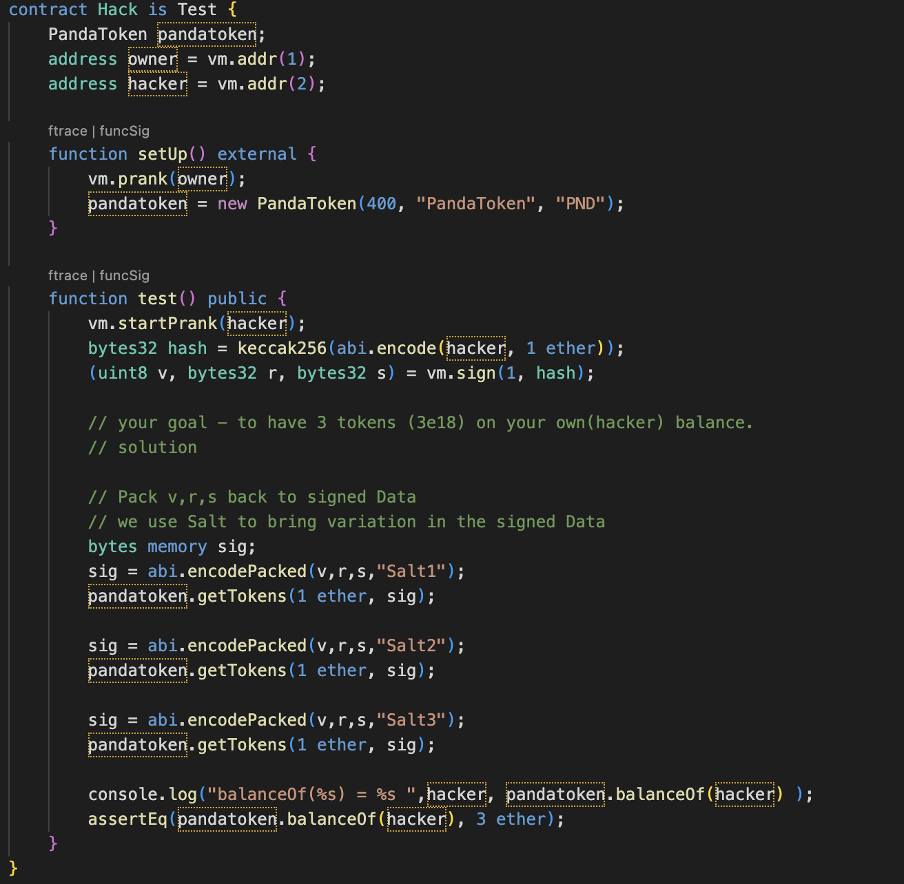
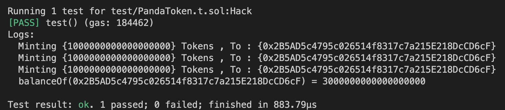

# Panda Token 
Submitted by Sidarth S

# Vulnerability
- Here the **PandaToken.sol** can be exploited by using the **V R S of ECDSA signature**, and constructing different sign messages using the context v,r,s bytes and some random salt.
- The constructor sets the storage slots, such that zero address starts with a balance of 10 ether in his account.

# Steps to Exploit

## Attack Process
- 

- The Hacker uses the V R S , to construct the signature bytes.
- To pass unique signature , we use *salt* string, to bring some noise in the sign hash.
- we exploit the intial balance of 10 ether given to ZeroAddress by the constructor.
- Since max limit is 1 ether, we try calling the *getTokens()* atleast three times.

## Result

# Conclusion:
Thus the goal - to have 3 tokens (3e18) on your own(hacker) balance, has been achieved.

