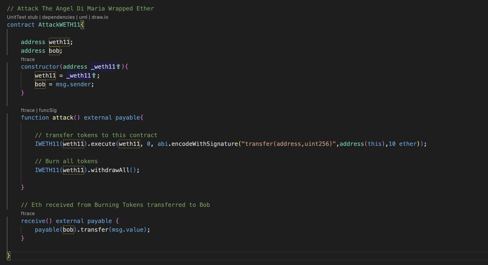

# WETH11
Submitted by Sidarth S

# Vulnerability
- Here the **WETH11.sol** can be exploited by using the external call done in **execute()**

# Steps to Exploit

## Attack Process
- 

- First, we deploy AttackWETH11 contract with address of the weth11 contract as argument.
- **attack()** in the AttackWETH11 contract is executed.
- the attack() calls the execute() in WETH11 contract, which in turn calls the transfer() in WETH11 contract.
- Thus transferring all the tokens owned by WETH11 to AttackWETH11 contract.
- Now that we have the tokens, we burn all the tokens to get eth.
- The receive() function on receiving ether, transfers to bob.

## TestCase

## Result

# Conclusion:
Thus the goal of
- Bob receive back 10 ether is achieved
- empty weth contract is achieved
- empty weth on weth contract is done

